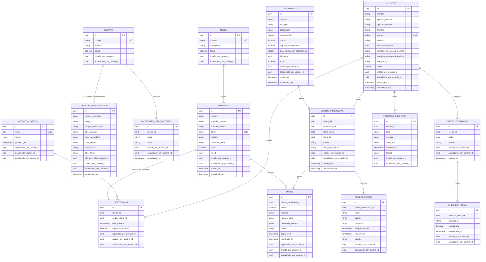

# Diagrama Relacional - Plataforma de Gestión de Gimnasio

```mermaid
erDiagram
    USUARIOS {
        uuid id PK
        string nombre
        string apellido_paterno
        string apellido_materno
        string correo "UNQ"
        string telefono
        string password_hash
        boolean activo
        uuid rol_id
        uuid creado_por_usuario_id
        uuid actualizado_por_usuario_id
        timestamp creado_en
        timestamp actualizado_en
    }
    ROLES {
        uuid id PK
        string nombre "UNQ"
        string descripcion
        boolean activo
        uuid creado_por_usuario_id
        uuid actualizado_por_usuario_id
    }
    GIMNASIO_CONFIGURACION {
        uuid id PK
        string nombre_gimnasio
        string logo_url
        string imagen_portada_url
        string color_primario
        string color_secundario
        string color_acento
        string color_fondo
        string color_texto
        uuid idioma_predeterminado_id
        uuid creado_por_usuario_id
        uuid actualizado_por_usuario_id
        timestamp actualizado_en
    }
    IDIOMAS {
        uuid id PK
        string codigo "UNQ"
        string nombre
        boolean activo
        uuid creado_por_usuario_id
        uuid actualizado_por_usuario_id
    }
    DICCIONARIO_TRADUCCIONES {
        uuid id PK
        uuid idioma_id
        string clave
        string valor
        uuid creado_por_usuario_id
        uuid actualizado_por_usuario_id
        timestamp actualizado_en
    }
    CLIENTES {
        uuid id PK
        string nombre
        string apellido_paterno
        string apellido_materno
        string telefono
        string correo "UNQ"
        string direccion
        date fecha_nacimiento
        string contacto_emergencia_nombre
        string contacto_emergencia_telefono
        string foto_perfil_url
        boolean activo
        uuid creado_por_usuario_id
        uuid actualizado_por_usuario_id
        timestamp creado_en
        timestamp actualizado_en
    }
    MEMBRESIAS {
        uuid id PK
        string nombre
        string tipo_plan
        string descripcion
        integer duracion_dias
        decimal precio
        boolean requiere_recordatorio
        integer dias_anticipacion_recordatorio
        uuid idioma_id
        boolean activo
        uuid creado_por_usuario_id
        uuid actualizado_por_usuario_id
        timestamp creado_en
        timestamp actualizado_en
    }
    CLIENTE_MEMBRESIAS {
        uuid id PK
        uuid cliente_id
        uuid membresia_id
        date fecha_inicio
        date fecha_fin
        string estado
        string codigo_qr_actual
        uuid creado_por_usuario_id
        uuid actualizado_por_usuario_id
        timestamp creado_en
        timestamp actualizado_en
    }
    PAGOS {
        uuid id PK
        uuid cliente_membresia_id
        decimal monto
        string moneda
        string metodo_pago
        string referencia_externa
        string estado
        timestamp pagado_en
        timestamp registrado_en
        uuid registrado_por_usuario_id
        uuid creado_por_usuario_id
        uuid actualizado_por_usuario_id
    }
    CODIGOS_DIARIOS {
        uuid id PK
        date fecha "UNQ"
        string codigo
        timestamp generado_en
        uuid regenerado_por_usuario_id
        uuid creado_por_usuario_id
        uuid actualizado_por_usuario_id
    }
    ASISTENCIAS {
        uuid id PK
        uuid cliente_id
        uuid codigo_diario_id
        timestamp hora_entrada
        boolean registrada_manual
        uuid registrado_por_usuario_id
        uuid creado_por_usuario_id
        uuid actualizado_por_usuario_id
    }
    CHECKLISTS_DIARIOS {
        uuid id PK
        uuid cliente_id
        date fecha
        string estado
        uuid creado_por_usuario_id
        uuid actualizado_por_usuario_id
        timestamp creado_en
    }
    CHECKLIST_ITEMS {
        uuid id PK
        uuid checklist_diario_id
        string descripcion
        boolean completado
        timestamp completado_en
        uuid creado_por_usuario_id
        uuid actualizado_por_usuario_id
    }
    RECORDATORIOS {
        uuid id PK
        uuid cliente_membresia_id
        string canal
        string asunto
        string contenido
        timestamp programado_en
        timestamp enviado_en
        string estado
        uuid creado_por_usuario_id
        uuid actualizado_por_usuario_id
    }
    NOTIFICACIONES_PUSH {
        uuid id PK
        uuid cliente_id
        string titulo
        string mensaje
        string data_json
        timestamp enviado_en
        string estado
        uuid creado_por_usuario_id
        uuid actualizado_por_usuario_id
    }

    ROLES ||--o{ USUARIOS : asigna
    IDIOMAS ||--o{ GIMNASIO_CONFIGURACION : "se usa como predeterminado"
    IDIOMAS ||--o{ DICCIONARIO_TRADUCCIONES : "contiene"
    CLIENTES ||--o{ CLIENTE_MEMBRESIAS : posee
    MEMBRESIAS ||--o{ CLIENTE_MEMBRESIAS : define
    CLIENTE_MEMBRESIAS ||--o{ PAGOS : "genera"
    CLIENTE_MEMBRESIAS ||--o{ RECORDATORIOS : "programa"
    CLIENTES ||--o{ ASISTENCIAS : registra
    CODIGOS_DIARIOS ||--o{ ASISTENCIAS : valida
    USUARIOS ||--o{ ASISTENCIAS : "registra manualmente"
    USUARIOS ||--o{ PAGOS : "confirma"
    CLIENTES ||--o{ CHECKLISTS_DIARIOS : "completa"
    CHECKLISTS_DIARIOS ||--o{ CHECKLIST_ITEMS : "incluye"
    CLIENTES ||--o{ NOTIFICACIONES_PUSH : recibe
```
