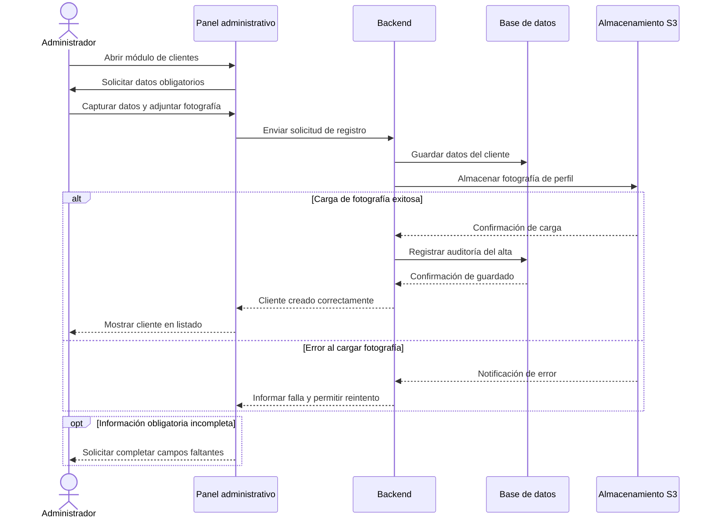
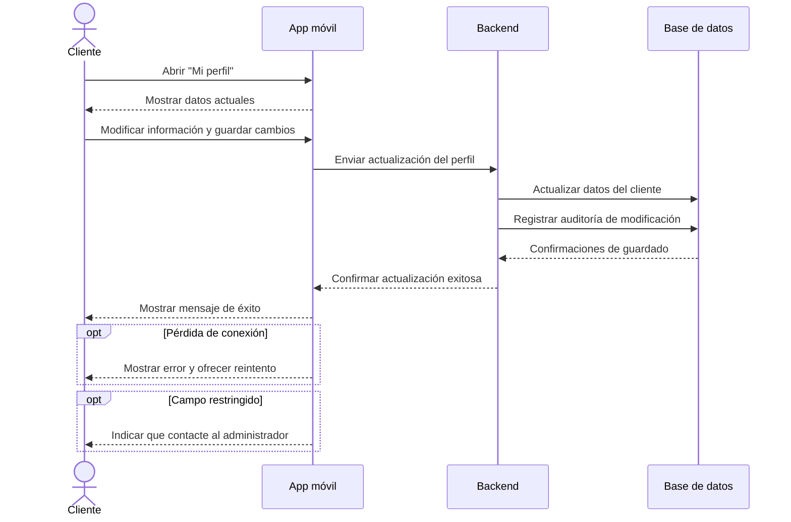
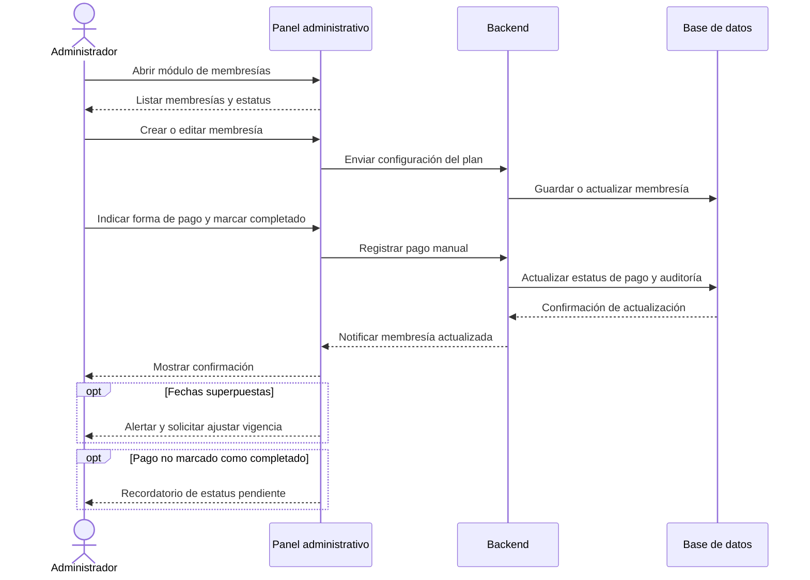
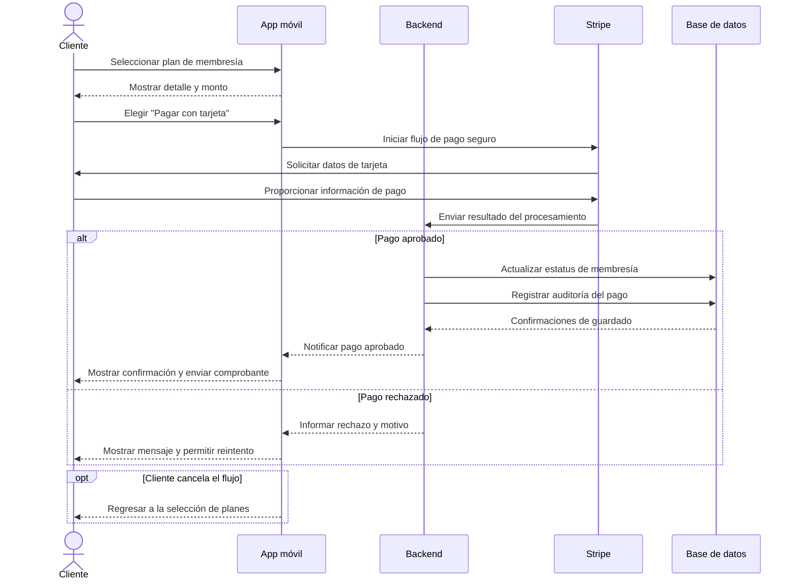
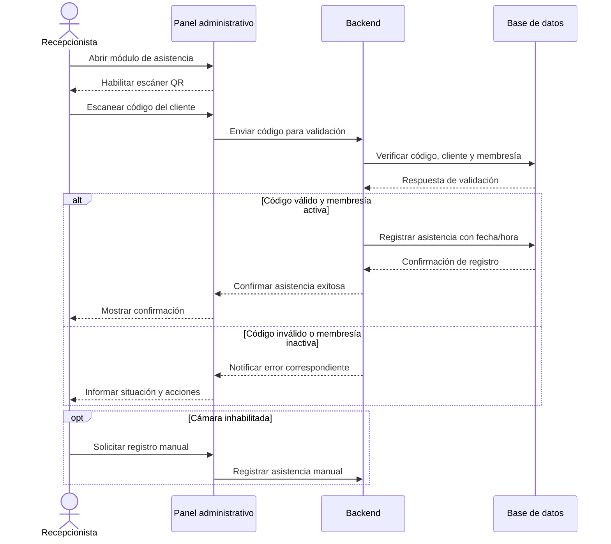
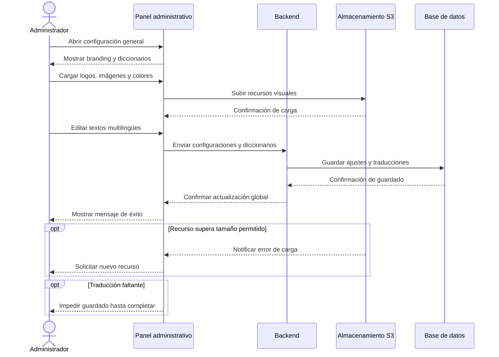
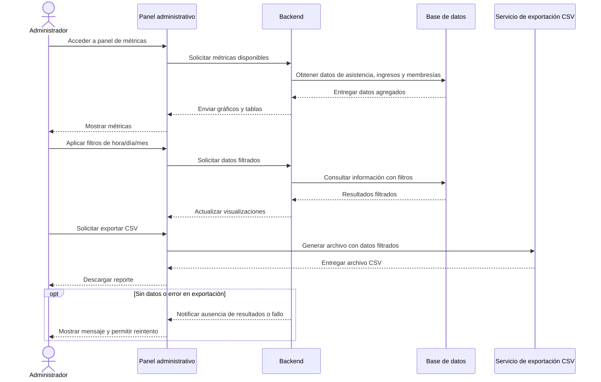

# Diagramas de Secuencia - Plataforma de Gestión de Gimnasio

A continuación se describen los principales diagramas de secuencia del sistema en formato **Mermaid**, alineados con los casos de uso definidos para la plataforma.

## UC-01 Gestionar registro de cliente

## UC-02 Actualizar perfil desde la aplicación móvil

## UC-03 Gestionar membresías y pagos manuales

## UC-04 Pagar membresía con tarjeta desde la app

## UC-05 Registrar asistencia mediante código QR

## UC-06 Configurar branding y diccionarios

## UC-07 Consultar métricas y exportar reportes

